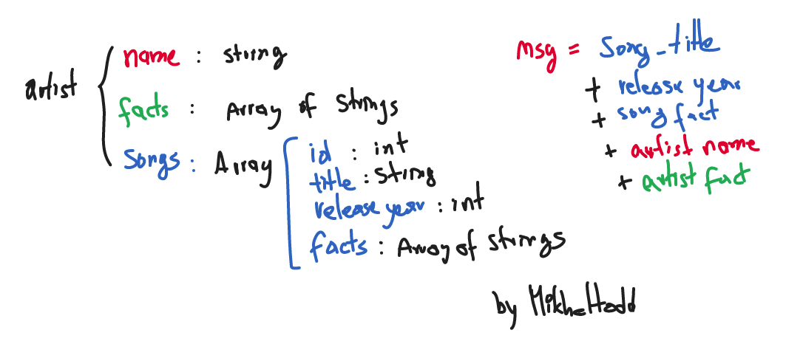

# MixedMessages
> A message generator program. Portfolio project from Codecademy.

## Table of Contents
- [MixedMessages](#mixedmessages)
  - [Table of Contents](#table-of-contents)
  - [General Information](#general-information)
  - [Technologies Used](#technologies-used)
  - [Features](#features)
  - [Screenshots](#screenshots)
  - [Setup](#setup)
  - [Usage](#usage)
  - [Project Status](#project-status)
  - [Room for Improvement](#room-for-improvement)
  - [Acknowledgements](#acknowledgements)
  - [Contact](#contact)
  - [License](#license)
<!-- * [License](#license) -->

## General Information
- Every time a user runs a program, they should get a new, randomized output. 
- Project Objectives:
    * Build a message generator program using JavaScript
    * Use Git version control
    * Use command line
    * Local development
- This is a portfolio project to show basic JS commands and version control skills
- The purpose of this project is to design a program to generate randomized (and coherent) messages about different topics. 
- I started this project following the Codecademy's Full Stack Path and practice my programming skills.

## Technologies Used
- JavaScript
- Git and GitHub
- Command line

## Features
- Message Generator (random) about Music Facts

## Screenshots

## Setup
For this project to work in your own computer, you need to install node.js. 
Clone this repository in your own PC and follow usage instructions.

## Usage
After downloading this folder (cloning the repository in your computer), go to the files location and open the terminal. Type the following code:

`node script.js`

## Project Status
Project is: _in progress_ 

## Room for Improvement

It could be great if the user could select the topic the messages are about. The program could provide a list of topics and the user chooses the one he/she most like. 

Room for improvement:
- Show the user different topic options
- Depending on the user's input, select a topic on the main object (create a file to import)

To do:
- Create an object containing different topics
- Depending on the topic, define the structure of the message

## Acknowledgements

- This project was inspired by Codecademy
- This project was based on [this tutorial](https://www.codecademy.com/paths/full-stack-engineer-career-path/tracks/fscp-javascript-syntax-portfolio-project/modules/fscp-mixed-messages/kanban_projects/mixed-messages).
- Many thanks to... Google

## Contact
Created by [@Mikheltodd](https://github.com/Mikheltodd) - feel free to contact me!

## License
This project is open source.
